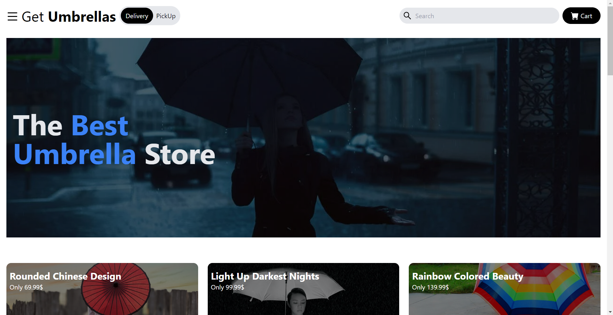

# [Get Umbrellas](https://naimur29-getumbrellas.netlify.app/)

> This is my Online Umbrella Store project (unfinished)

---

### Header:

- [Description](#description)
- [How To Use](#how-to-use)

---

## Description

Get whatever umbrellas you like 😁!! Best umbrella store you can find...  
Dev Goal: Learn Tailwind CSS with responsive design in mind...

### Packages:  
1. Used React JS Framework.  
2. Tailwind CSS for designing.  
3. Yarn as package manager  
4. Vanilla JavaScript Language.  
5. HTML & Vanilla CSS.

### Some features of my project:  
1. This site is responsive for mobile and Desktop.  

---

## How To Use

If you want download this project you can download zip file or clone this site.
After download you open the project in your IDE and open your terminal. Then for running this project you type in your terminal "yarn start".

---

## Live link:
- [Click to visit Get Umbrellas](https://naimur29-getumbrellas.netlify.app/)
